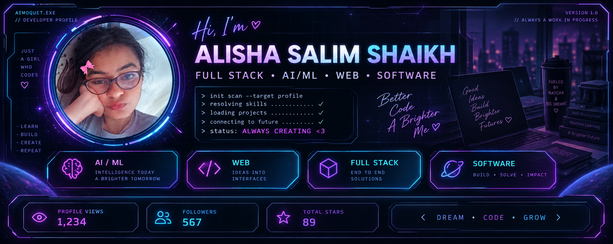

<div align="center">



<br><br>

<a href="#-about-me">

</a>
&nbsp;
<a href="#-tech-stack">

</a>
&nbsp;
<a href="#-featured-projects">

</a>
&nbsp;
<a href="#-github-stats">

</a>
&nbsp;
<a href="#-lets-connect">

</a>

<br><br>

<a href="https://github.com/aimoquet">

</a>
&nbsp;
<a href="https://www.linkedin.com/in/alisha-shaikh-93632b2aa/">

</a>
&nbsp;
<a href="https://www.instagram.com/___alisha___27/">

</a>
&nbsp;
<a href="mailto:alisha270105@gmail.com">

</a>

<br><br>


</div>

---

<div align="center">

# 👋 HELLO, I'M ALISHA

### `INFORMATION TECHNOLOGY STUDENT` · `FULL-STACK DEVELOPER` · `AI/ML EXPLORER`

<br>

> **Turning ideas in my head into things people can actually use. 🚀**

<br>

`☕ COFFEE` → `💻 CODE` → `🐛 BUGS` → `🧠 LEARN` → `🚀 BUILD`

</div>

---

# 🧠 ABOUT ME

<table>
<tr>

<td width="60%" valign="top">

## 👩🏻‍💻 `whoami`

I'm an **Information Technology student** who loves taking random ideas and turning them into actual working projects.

### 🔍 Currently interested in

💻 **Full-Stack Development**  
🤖 **Artificial Intelligence & Machine Learning**  
🌐 **Modern Web Applications**  

### ✨ I enjoy

- 🎨 Making boring interfaces look better
- 💻 Building applications from scratch
- 🤖 Experimenting with AI/ML
- 🧩 Solving problems through projects
- 🚀 Learning by actually building

<br>

> ### 💭 My Rule
>
> **Build → Break → Learn → Build again.**

</td>

<td width="40%" align="center">

```text
╭─────────────────────────────╮
│                             │
│       AIMOQUET.EXE          │
│                             │
│  USER     : ALISHA          │
│  STATUS   : ● ONLINE        │
│  MODE     : BUILDING        │
│                             │
│  CURIOSITY                 │
│  ████████████████████ 100%  │
│                             │
│  COFFEE                    │
│  ████████████████░░░░  80%  │
│                             │
│  LEARN  →  BUILD            │
│  BUILD  →  BREAK            │
│  BREAK  →  LEARN            │
│                             │
│  SYSTEM MESSAGE             │
│  Creating something cool ✨ │
│                             │
╰─────────────────────────────╯
